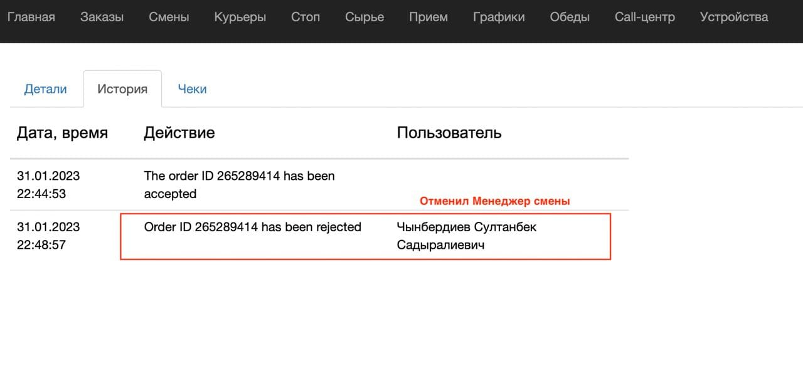

# Canceled orders service

[](https://codecov.io/gh/goretsky-integration/canceled-orders)
[](https://github.com/goretsky-integration/canceled-orders/actions/workflows/test.yaml)

---

## What is this service for?

This service is intended for identifying specific types of <u>canceled orders</u> for the previous day based on certain
criteria.

---

## Criteria for canceled orders:

- Criteria set #1:
    - Sales channel - restaurant
    - Order canceled by any employee.
- Criteria set #2:
    - Sales channel - delivery
    - A courier was assigned to the order.

---

## How to understand that the order was canceled by an employee?

In the order history, the third column will indicate the employee's name.


---

## What data about the order is collected?

- Order ID.
- Point of sale name.
- Order number.
- Order price.
- Sales channel (restaurant, delivery).
- Existence of a cancellation receipt.

---

## Setup and run the service

****### 1. Clone the repository

```shell
git clone https://github.com/goretsky-integration/canceled-orders
```

### 2. Create poetry virtual environment

```shell
poetry env use python3.11
```

### 3. Activate it

```shell
poetry shell
```

### 4. Install dependencies

```shell
poetry install --without dev
```

### 5. Set up config file [instruction](#set-up-config-file)

```shell
cp config.example.toml config.toml
```

### 6. Run the service

```shell
python src/main.py
```

---

## Run tests

### 1. Clone the repository

```shell
git clone https://github.com/goretsky-integration/canceled-orders
```

### 2. Create poetry virtual environment

```shell
poetry env use python3.11
```

### 3. Activate it

```shell
poetry shell
```

### 4. Install dependencies

```shell
poetry install
```

### 5. Run the tests

```shell
pytest
```
